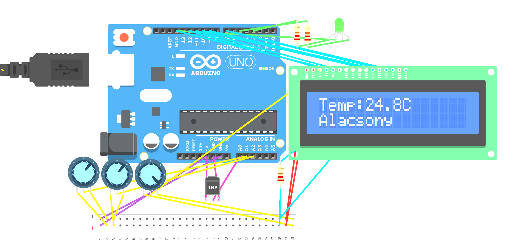

# PyroSense
PyroSense is an Arduino-based wildfire risk monitoring system that evaluates temperature, wind, and humidity to estimate fire danger levels and display them in real time.

A projekt teljes kapcsolása és szimulációja megtekinthető itt: [Tinkercad szimuláció](https://www.tinkercad.com/things/kXjqzLdo4nl-microproc-beadando-/editel?returnTo=https%3A%2F%2Fwww.tinkercad.com%2Fdashboard&sharecode=paB_99o3Bi_fUgsyWXNYZtUreOzRMOu3_8jmJwM53Fw)

## Magyar
## Áttekintés

A projekt célja annak bemutatása, hogyan lehet több környezeti tényezőt kombinálva egy egyszerű döntési rendszert létrehozni.  
A PyroSense nem valós előrejelző rendszer, hanem egy szemléltető modell, amely megmutatja, hogyan befolyásolja a hőmérséklet, a szél és a nedvesség a tűz kialakulásának kockázatát.

A rendszer folyamatosan olvassa a szenzorok adatait, majd ezek alapján meghatározza az aktuális veszélyszintet.

---

## Funkciók

- Valós idejű mérés:
  - hőmérséklet (TMP36 szenzor)
  - szél (potméterrel szimulálva)
  - páratartalom (potméterrel szimulálva)
- Többszintű kockázatértékelés:
  - alacsony
  - kockázat
  - magas
  - extrém
- Vizuális visszajelzés LED-del:
  - zöld → biztonságos
  - sárga → figyelmeztetés
  - piros → magas kockázat
  - villogó piros → extrém veszély
- LCD kijelző:
  - váltakozva mutatja a hőmérsékletet, szelet és páratartalmat
  - megjeleníti az aktuális állapotot

---

## Döntési logika

A rendszer három fő tényezőt vesz figyelembe:

- hőmérséklet
- páratartalom
- szélsebesség

### Kockázati szintek

- **Kockázat**
  - hőmérséklet ≥ 30°C
  - alacsony páratartalom
  - mérsékelt szél

- **Magas veszély**
  - hőmérséklet ≥ 32°C
  - száraz környezet
  - erős szél

- **Extrém veszély**
  - hőmérséklet ≥ 35°C
  - nagyon alacsony páratartalom
  - erős szél

### Biztonsági szabály

Amennyiben a hőmérséklet meghaladja a **60°C-ot**, a rendszer automatikusan extrém veszélyt jelez, függetlenül a többi tényezőtől.

---

## Hardver elemek

- Arduino Uno
- Breadboard
- TMP36 hőmérséklet szenzor
- 2 db potméter (szél és páratartalom szimuláció)
- RGB LED (csak piros és zöld csatorna használva)
- 16x2 LCD kijelző
- ellenállások és vezetékek

---

## Kijelzés

### LCD (váltakozó megjelenítés):
- `Temp: 34.5C`
- `Wind: Strong`
- `Hum: Very Dry`

### Állapot:
- Alacsony
- Kockázat
- Magas
- Extrém

---

## Megjegyzések

- A páratartalom értéke a kódban fordítottan kerül kiszámításra, mivel a potméter alacsony értéke jelenti a száraz állapotot.
- Az RGB LED kék csatornája nem kerül felhasználásra, hogy elkerüljük a színek keveredését.

---

## Cél

A projekt célja egy egyszerű, szemléletes rendszer létrehozása, amely bemutatja:
- szenzorok használatát
- környezeti adatok feldolgozását
- döntési logika alkalmazását beágyazott rendszerekben

## English
## Overview

The goal of this project is to demonstrate how multiple environmental factors can be combined to create a simple decision-making system.  
PyroSense does not predict real wildfires, but simulates how temperature, wind, and humidity together influence fire risk.

The system continuously reads sensor data and classifies the current conditions into different risk levels.

The full circuit and simulation of the project can be viewed here: [Tinkercad simulation](https://www.tinkercad.com/things/kXjqzLdo4nl-microproc-beadando-/editel?returnTo=https%3A%2F%2Fwww.tinkercad.com%2Fdashboard&sharecode=paB_99o3Bi_fUgsyWXNYZtUreOzRMOu3_8jmJwM53Fw)

## Features

- Real-time monitoring of:
  - Temperature (TMP36 sensor)
  - Wind (simulated with potentiometer)
  - Humidity (simulated with potentiometer)
- Multi-level risk evaluation:
  - Low
  - Moderate
  - High
  - Extreme
- Visual feedback using LED:
  - Green → Safe
  - Yellow → Warning
  - Red → High risk
  - Blinking Red → Extreme risk
- LCD display with rotating information:
  - Temperature
  - Wind level
  - Humidity level
  - Current risk state

---

## System Logic

The system evaluates wildfire risk based on three main factors:

- Temperature
- Humidity
- Wind speed

### Risk thresholds:

- **Moderate risk**
  - Temperature ≥ 30°C
  - Low humidity
  - Moderate wind

- **High risk**
  - Temperature ≥ 32°C
  - Dry conditions
  - Strong wind

- **Extreme risk**
  - Temperature ≥ 35°C
  - Very low humidity
  - Strong wind

### Fail-safe condition

If the temperature exceeds **60°C**, the system automatically triggers **EXTREME risk**, regardless of other values.

---

## Hardware Components

- Arduino Uno
- Breadboard
- TMP36 temperature sensor
- 2 × potentiometers (wind and humidity simulation)
- RGB LED (red and green channels used)
- 16x2 LCD display
- Resistors and jumper wires

---

## Display Output

### LCD (rotating):
- `Temp: 34.5C`
- `Wind: Strong`
- `Hum: Very Dry`

### Status line:
- `Low`
- `Risk`
- `HIGH`
- `EXTREME`

---

## Notes

- Humidity values are inverted in the code because lower sensor values represent drier conditions.
- The blue channel of the RGB LED is not used to avoid color mixing issues and ensure clear visual feedback.

---

## Purpose

This project was created as an educational demonstration of:
- sensor integration
- simple environmental modeling
- decision-making logic in embedded systems

---
